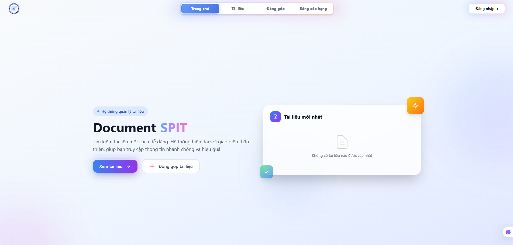

<h1 align="center">Document SPIT</h1>

<em>A modern, secure, and fast document management system for SPIT</em>

  
  
  
  
  
  

---

### Live Demo & Preview

    

## Introduction

Document SPIT centralizes academic and organizational documents with secure access and a smooth browsing experience. It supports role-based permissions, category hierarchies (department/course), rich previews, and audit history. The backend provides a clean REST API secured by JWT, while the frontend offers a fast, app-like interface built on Next.js.

## Key Features

- 🔐 Authentication & Authorization
  - JWT-based Access/Refresh tokens, role-based access (Admin), account lock/ban handling
- 📂 Document Management
  - Organize by Category/Department/Course; browse, filter, and download documents
- 🖼️ Preview & Export
  - Client-side PDF preview/export and image support; Google Drive integration on server
- 🧾 History & Insights
  - Action history/audit logs and basic statistics/dashboards
- 🛠️ Admin & User Experience
  - Admin-only routes to manage users, categories, and content; user profile/session
- ⚡ Developer-Friendly
  - Swagger in development, Dockerized workflow for both backend and frontend

---

### Tech Stack (at a glance)

- Backend: ASP.NET Core 8 (Web API), JWT, Swagger
- Frontend: Next.js 14, TypeScript, TailwindCSS, Ant Design
- Infra: Docker, SQL Server, Google Drive services

### Quick Links

- Website: [https://document.spit-husc.io.vn](https://document.spit-husc.io.vn)
